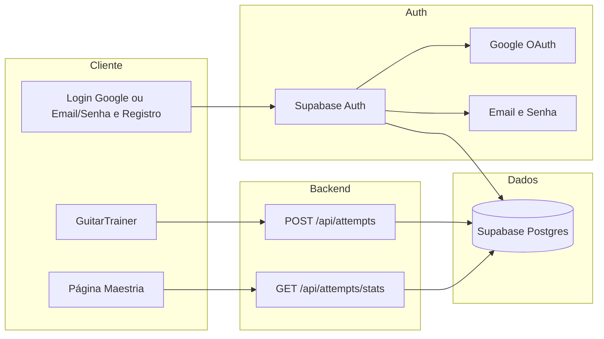

# Plano: Login (Google + opção sem Google) + Registro + Maestria por corda

## Visão geral

Adicionar autenticação (Google e email/senha), registro de usuários, persistência das tentativas de notas por usuário (Supabase) e uma área de estatísticas com gráfico de maestria por corda (acertos/total por corda).

---

## Opções de autenticação

### Opção A — Apenas Google (NextAuth)

- NextAuth.js com provider Google.
- Usuário só entra com “Entrar com Google”; não há registro manual nem login por email/senha.

### Opção B — Google + Login sem Google + Registro (recomendada)

Oferecer **duas formas de acesso**:

1. **Login com Google** (OAuth).
2. **Login sem Google**: email + senha (e, opcionalmente, “esqueci minha senha”).
3. **Registro**: criar conta com email + senha (e, se quiser, confirmação por email).

**Implementação sugerida (tudo em um só lugar):**

- Usar **Supabase Auth** para tudo:
  - **Google**: provider OAuth do Supabase (Google Cloud Console + Supabase Dashboard).
  - **Email/senha**: `signUp({ email, password })` e `signInWithPassword({ email, password })`; Supabase já gerencia usuários e senhas (hash).
- Assim evita manter duas stacks (NextAuth + outro) e já temos o `user_id` (Supabase `auth.uid()`) para a tabela `attempts` e RLS.

**Alternativa (manter NextAuth):**

- NextAuth com dois providers: **Google** + **Credentials**.
- Para Credentials: API route de **login** (POST `/api/auth/login`) que valida email/senha contra uma tabela `users` no Supabase (com senha hasheada, ex.: bcrypt).
- API route de **registro** (POST `/api/auth/register`): criar usuário na tabela `users` (email, hash da senha) e depois redirecionar para login ou auto-login.
- NextAuth Credentials provider chama essa API ou valida contra o mesmo `users`. Requer mais código (tabela de usuários, bcrypt, rotas de registro/login).

**Resumo:** Para ter “login sem Google” e “registro” com menos trabalho, o plano assume **Supabase Auth** (Google + Email/Password) como opção principal; se preferir NextAuth, usar Credentials + tabela `users` + rotas de registro/login.

---

## Arquitetura (com Supabase Auth — Opção B)

---

## 1. Autenticação (detalhando Opção B)

### Supabase Auth (Google + Email/Password + Registro)

- **Google**: no Supabase Dashboard, Authentication → Providers → Google (Client ID e Secret do Google Cloud Console). No cliente, `signInWithOAuth({ provider: 'google' })`.
- **Registro**: tela “Criar conta” com email + senha; chamar `supabase.auth.signUp({ email, password })`. Opcional: habilitar “Confirm email” no Supabase e tela “Verifique seu email”.
- **Login sem Google**: tela “Entrar” com email + senha; chamar `supabase.auth.signInWithPassword({ email, password })`.
- **Recuperação de senha** (opcional): `supabase.auth.resetPasswordForEmail(email)` e configurar template de email no Supabase.

### Onde fica no projeto

- **Cliente**: `@supabase/supabase-js` (browser) com `NEXT_PUBLIC_SUPABASE_URL` e `NEXT_PUBLIC_SUPABASE_ANON_KEY`.
- **Componente de área de login/registro**:
  - Abas ou links: “Entrar com Google” | “Entrar com email” | “Criar conta”.
  - Formulário “Entrar”: email, senha, botão “Entrar”.
  - Formulário “Criar conta”: email, senha (e confirmação de senha), botão “Registrar”.
- **Proteção de rotas**: nas páginas que exigem login (ex.: Maestria), verificar sessão Supabase (`supabase.auth.getSession()` ou React context/hook) e redirecionar para a tela de login ou mostrar “Entre ou registre-se para ver sua maestria”.

---

## 2. Modelo de dados e persistência

- **Tabela `attempts`** (igual ao plano original):

| Coluna        | Tipo       | Descrição                                |
|---------------|------------|------------------------------------------|
| id            | uuid       | PK, default `gen_random_uuid()`          |
| user_id       | uuid       | `auth.uid()` do Supabase                |
| string_number | smallint   | 1–6 (corda)                             |
| fret          | smallint   | 0–12                                    |
| note_name     | text       | ex: "A", "F#"                           |
| is_correct    | boolean    | acerto ou erro                          |
| created_at    | timestamptz| default `now()`                         |

- **RLS**: políticas para `user_id = auth.uid()` (SELECT e INSERT).

---

## 3. API Routes e gravação no GuitarTrainer

- **POST `/api/attempts`**: recebe `{ stringNumber, fret, noteName, isCorrect }`; obtém usuário via cookie/session do Supabase (ou token no header) e insere em `attempts`. Se usar Supabase no cliente, pode-se também inserir direto do client com RLS (então essa rota pode ser opcional).
- **GET `/api/attempts/stats`**: retorna estatísticas agregadas por corda para o usuário logado (ex.: `{ byString: { 1: { correct, total }, ... } }`).
- No **GuitarTrainer**, após cada validação, se houver sessão: enviar a tentativa (POST `/api/attempts` ou `supabase.from('attempts').insert(...)`).

---

## 4. Página de maestria por corda

- Rota: ex. `/maestria`.
- Conteúdo: só para logados; caso contrário, “Entrar ou registrar para ver sua maestria” com links para login/registro.
- Gráfico e detalhes: acertos e total por corda (1–6), usando ex.: Recharts (barras ou %).

---

## 5. Resumo de opções no plano

| Item                    | Opção A (só Google)     | Opção B (Google + email + registro)   |
|-------------------------|-------------------------|---------------------------------------|
| Login com Google        | Sim (NextAuth)          | Sim (Supabase Auth)                   |
| Login sem Google        | Não                     | Sim (email + senha)                  |
| Registro (criar conta)  | Não                     | Sim (email + senha)                   |
| Stack de auth           | NextAuth                | Supabase Auth                         |
| Tabela `attempts`       | Supabase (user_id = id do NextAuth) | Supabase (user_id = auth.uid()) |
| UI                      | Botão “Entrar com Google” | “Entrar com Google” + “Entrar com email” + “Criar conta” |

---

## 6. Arquivos a criar/alterar (com Opção B)

- Criar: `src/lib/supabase.ts` (client browser) e, se usar API routes, client server-side para Supabase.
- Criar: componentes de UI de login/registro (formulários + “Entrar com Google”).
- Criar: `src/app/api/attempts/route.ts` e `src/app/api/attempts/stats/route.ts` (ou lógica no client com RLS).
- Criar: `src/app/maestria/page.tsx` e componente de gráfico.
- Alterar: `layout.tsx` (ex.: provider de auth/session se necessário), `page.tsx` (header com login/registro e link Maestria), `GuitarTrainer.tsx` (gravar tentativa quando logado).
- Alterar: `src/types/index.ts` (tipos de tentativa e estatísticas), `.env.example` (Supabase + Google se usar OAuth no Supabase).

---

## Ordem sugerida de implementação

1. Configurar Supabase (projeto, Auth: Google + Email habilitados, tabela `attempts` + RLS).
2. Implementar telas de login (Google + email/senha) e registro (criar conta).
3. Integrar área de login/registro no header e proteção da página de maestria.
4. Implementar gravação de tentativas (client ou API) e GET de estatísticas.
5. Implementar página de maestria com gráfico e detalhes por corda.
6. Atualizar `.env.example` e documentação.

Com isso, o plano passa a incluir explicitamente a opção de **login sem Google** e **registro**, além do login com Google.
